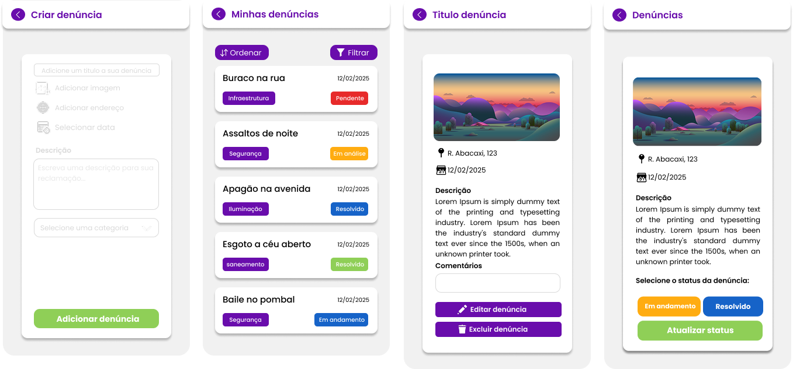
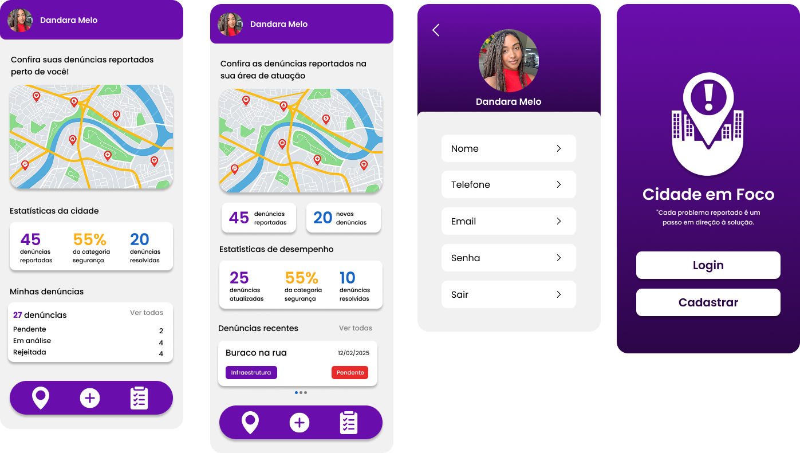

# Cidade em Foco

## Descrição

O Cidade em Foco é um aplicativo desenvolvido para facilitar o envio e o acompanhamento de denúncias urbanas, permitindo que cidadãos registrem problemas como buracos, iluminação pública defeituosa, descarte irregular de lixo e outros transtornos do dia a dia.

A plataforma aproxima a população das autoridades responsáveis, oferecendo um meio rápido, simples e eficiente para comunicar ocorrências e acompanhar o progresso de cada solicitação.


## Time de Desenvolvimento

- [Dandara Melo](https://github.com/dandsmelo)
- [Mariana Julia](https://github.com/marianajulia)


## Funcionalidades

- Cadastro e login de usuários  
- Envio de denúncias com foto e geolocalização  
- Edição e exclusão da denúncia  
- Visualização do status da solicitação   


## Stack Utilizada

- Mobile: React Native, TypeScript e Expo
- Back-end: Node.js
- Banco de Dados: MongoDB


## Protótipos





## Como Executar o Projeto

1. Navegue até a pasta raiz do projeto.
2. Execute o comando abaixo para instalar as dependências necessárias:

```bash
npm install
```
3. Inicie o projeto com o comando abaixo:

```bash
npx expo start
```
Isso abrirá o Expo Developer Tools, permitindo executar o aplicativo pelo Expo Go ou em um emulador.
